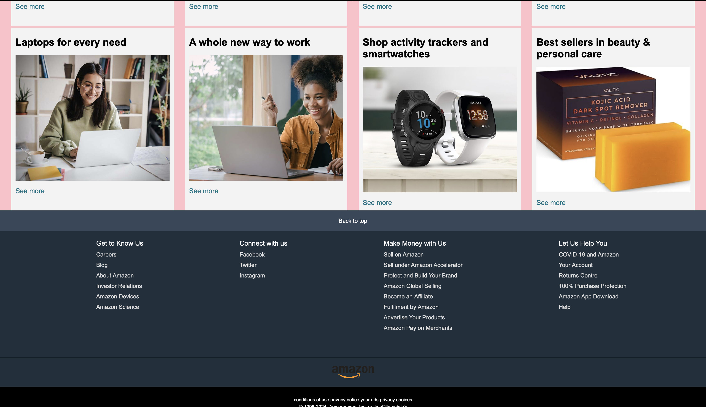

# Amazon Clone - Landing Page

This is a simple clone of the **Amazon landing page**, built using only **HTML** and **CSS**. It replicates the layout and basic styling of Amazon's homepage to practice front-end development skills.

##  Features

- Header with logo, search bar, and navigation
- Product category sections
- Sample product cards
- Footer with basic links

 **Note**: This is a static clone of just the **first page** of Amazon. It is non-functional and meant for design practice only.

##  Built With

- HTML5
- CSS3 
## live 
[live demo](https://saitejaswini-25.github.io/Amazonclone/)
## Images

